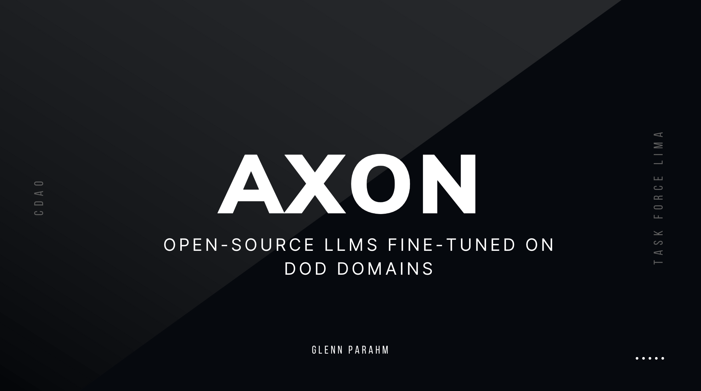

# Axon

A technical framework for using Large Language Models (LLMs) at the Department of Defense.

## Why Axon?

LLMs have proven to be an extremely powerful tool over the past few years. There's been an explosion in interest in utilizing LLMs in the DoD context, which is why [Task Force Lima](https://www.dds.mil/taskforcelima) was stood up.

However, there are a number of challenges to using LLMs in the DoD context (ex: access to compute, quality data, etc.). Axon is a technical framework that aims to address these challenges.

## What is Axon?

Axon is an end-to-end stack that guides DoD developers through the LLMops life cycle:

- transforming unstructured data
- fine-tuning open-source LLMs
- hosting models
- evaluations/benchmarks

## The Axon Stack

### Synthetic Data Generation

There is no shortage of data/information across the Department of Defense–but there is a shortage of **quality** data.
